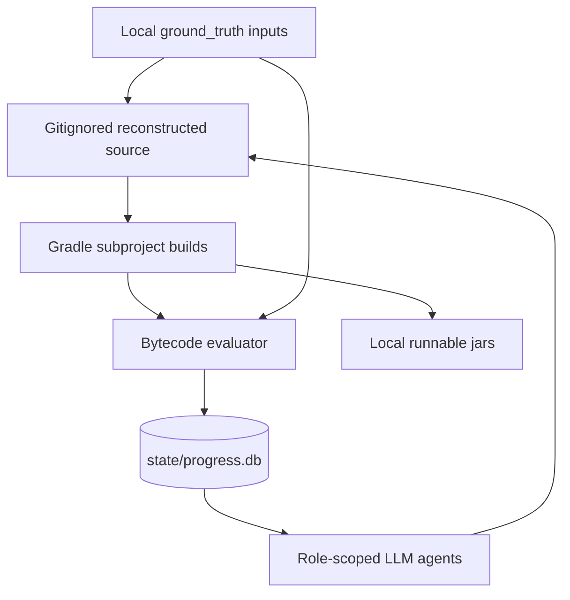
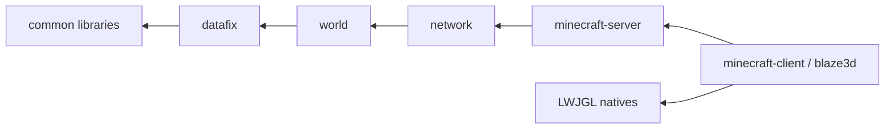
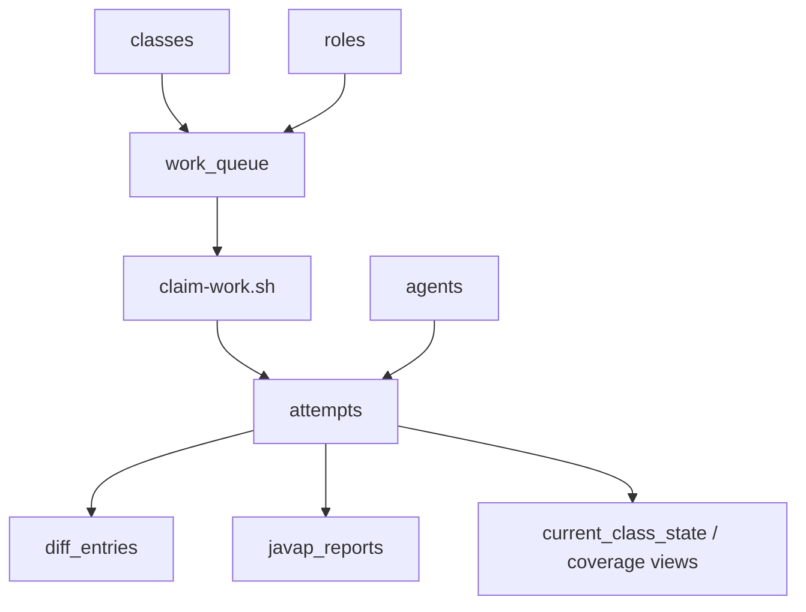
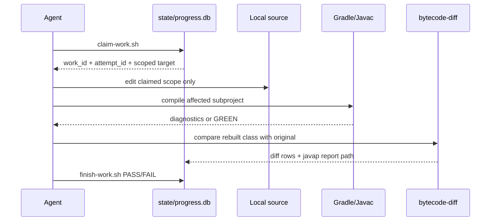

# ARCHITECTURE — Minecraft 26.1.2 Reconstruction

> Living architecture document. It describes the repository structure, runtime state surfaces, subproject graph, evaluator pipeline, and artifact boundaries. Keep it synchronized with `DESIGN.md`, `AGENTS.md`, and the deeper notes under `docs/architecture/`.

## 1. Architectural Summary

`demcstify` is organized around a simple invariant: **published scaffolding is separate from local reconstructed code**. The repository contains the machinery required to reconstruct, compile, diff, verify, and package Minecraft 26.1.2 locally, but the copyrighted inputs and generated outputs remain outside version control.

The architecture has five major surfaces:

1. **Input surface** — user-supplied JAR and manifest under `ground_truth/`.
2. **Source surface** — local reconstructed Java under `subprojects/*/src/`.
3. **Build surface** — Gradle subprojects, pinned toolchain, external dependencies, runnable jars.
4. **State surface** — normalized SQLite database plus javap evidence files.
5. **Agent surface** — roles, work queue, evaluator contracts, and documentation.



### 1.1 Research-to-Architecture Mapping

The architecture borrows lessons from LLM-assisted decompilation research and practice without importing external project code or data.

| External reference | Architectural response |
| --- | --- |
| [DecLLM](https://dl.acm.org/doi/abs/10.1145/3728958) | The build surface exposes recompilation as an oracle through strict Gradle tasks, while `attempts.compile_status_id` records whether each repair actually made source compilable. |
| [LLM4Decompile](https://github.com/albertan017/LLM4Decompile) | The source surface models a tool-plus-LLM pipeline: Vineflower produces a draft, agents repair it, and evaluator tasks decide success instead of model confidence. |
| [ByteCodeLLM](https://github.com/cyberark/ByteCodeLLM) | The input and evidence surfaces keep bytecode available for recovery when decompiler output is incomplete: original classes stay under `ground_truth/`, and generated `javap` reports stay under `state/javap/`. |
| [D-LiFT](https://arxiv.org/html/2506.10125v2) | The evaluator surface checks correctness before readability: bytecode identity and approved Tier B equivalence are gates, while cleanup is subordinate to those verdicts. |
| [LLM4CodeRE](https://arxiv.org/abs/2604.06095) | The agent surface can accommodate task-adapted reverse-engineering models, but model outputs are normalized through the same claim/attempt/evaluator tables rather than becoming a separate source of truth. |
| [Chris Lewis, "The Long Tail of LLM-Assisted Decompilation"](https://blog.chrislewis.au/the-long-tail-of-llm-assisted-decompilation/) | The state and agent surfaces are built for the long tail: atomic queue claims, append-only attempt history, role-scoped hooks, and future similarity-ranked work selection. |

## 2. Repository Layout

```text
demcstify/
├─ AGENTS.md                         # Agent guardrails and work protocols
├─ CLAUDE.md -> AGENTS.md            # Symlink alias for Claude-style tools
├─ README.md                         # Public overview and legal stance
├─ NOTICE.md                         # Mojang/Microsoft rights-holder notice
├─ DESIGN.md                         # Technical/product design spine
├─ ARCHITECTURE.md                   # This architecture spine
├─ LLM_CODESTYLES.md                 # Coding and documentation standards
├─ docs/
│  ├─ README.md                      # Documentation index
│  ├─ adr/                           # Architecture decision records
│  ├─ architecture/                  # Architecture diagrams and deep dives
│  ├─ design/                        # Design notes and publication contract
│  └─ research/                      # Research framing and operational notes
├─ ground_truth/                     # Gitignored user-supplied input area
│  ├─ 26.1.2.jar                     # User-supplied Minecraft JAR
│  ├─ 26.1.2.json                    # User-supplied manifest JSON
│  └─ src-vineflower/                # Raw Vineflower output, local only
├─ subprojects/                      # Build glue tracked; src trees gitignored
│  ├─ minecraft-common/
│  ├─ minecraft-server/
│  ├─ minecraft-client/
│  ├─ brigadier/
│  ├─ datafixerupper/
│  ├─ authlib/
│  ├─ blaze3d/
│  └─ <other carved-out packages>/
├─ state/
│  ├─ progress.db                    # SQLite source of truth, LFS-tracked
│  └─ javap/                         # Generated javap reports, gitignored
├─ scripts/
│  ├─ gradle.sh                      # Pinned Gradle launcher
│  ├─ progress-schema.sql            # Normalized database schema
│  ├─ init-progress-db.sh            # JAR inventory and initial queue seed
│  ├─ claim-work.sh                  # Atomic queue claim + attempt creation
│  ├─ finish-work.sh                 # Attempt finalization and claim release
│  ├─ enqueue-work.sql               # Phase-advance queue seeding
│  ├─ enqueue-bytecode-work.sh       # Per-class bytecode-aligner queue seed
│  ├─ decompile.sh                   # Pinned Vineflower invocation
│  ├─ route-vineflower-output.sh     # Mechanical package router
│  ├─ probe-toolchain.sh             # JDK/toolchain probe cascade
│  ├─ bytecode-diff.mjs              # Raw class-byte comparator
│  └─ verdict-shim.mjs               # Canonical evaluator wrapper
├─ settings.gradle.kts               # Subproject inclusion and plugin management
├─ build.gradle.kts                  # Root build logic and cross-project tasks
├─ gradle.properties                 # Toolchain and memory pins
├─ gradle/wrapper/                   # Gradle wrapper files
├─ .tool-versions                    # asdf/mise Java pin mirror
├─ .vfox.toml                        # vfox Java pin mirror
├─ .gitattributes                    # LFS and line-ending rules
└─ .gitignore                        # Local source/output/input boundaries
```

## 3. Local-Only Boundaries

The following paths must remain untracked:

| Path | Ownership | Reason |
| --- | --- | --- |
| `ground_truth/` | User input and raw decompile output | Contains original or derived game material |
| `subprojects/*/src/` | Reconstructed source | Local derivative output only |
| `subprojects/*/build/` | Recompiled classes and jars | Local build output |
| `build/runnable/` | Local runnable jars | Contains reconstructed game runtime artifacts |
| `state/javap/` | Generated diff evidence | Reproducible local diagnostics |
| `*.hprof` | Heap dumps | Large local diagnostics, not publishable |

Tracked files are the method: scripts, schema, Gradle glue, documentation, and ADRs.

## 4. Subproject Layering

Compile and queue scheduling use a layered dependency model.

| Ordinal | Layer | Subprojects / packages | Allowed dependencies |
| --- | --- | --- | --- |
| 0 | `common` | carved-out libraries, shared low-level code | JDK and declared external libraries |
| 1 | `datafix` | DFU schema migrators and data converters | `common` |
| 2 | `world` | blocks, chunks, NBT, biomes, registries | `common`, `datafix` |
| 3 | `network` | protocol, packets, codecs | lower layers |
| 4 | `server` | `minecraft-server`, game loop, dedicated server | lower layers |
| 5 | `client` | `minecraft-client`, `blaze3d`, rendering/audio/input | lower layers + LWJGL |



Dependency rule: a subproject may depend only on lower layers. Temporary `sourcepath` bridges are allowed for symbol resolution only; they must not emit another subproject's classes into the wrong artifact.

## 5. Package Ownership

Package ownership controls both routing and write scope.

| Package family | Owning subproject | Notes |
| --- | --- | --- |
| `net.minecraft.server.*` | `minecraft-server` | Server code must stay server-owned |
| `net.minecraft.gametest.*` | `minecraft-server` | Server/test harness ownership |
| `net.minecraft.client.*` | `minecraft-client` | Client runtime code |
| `net.minecraft.realms.*` | `minecraft-client` | Client/Realms code |
| `com.mojang.realmsclient.*` | `minecraft-client` | Realms client code |
| Shared `net.minecraft.*` | `minecraft-common` unless carved out | Common only when not server/client-specific |
| General-purpose libraries | Dedicated subprojects when useful | Brigadier, DFU, Authlib, Blaze3D-related carve-outs |

`minecraft-common` may temporarily compile against server symbols through `CompileOptions.sourcepath` plus `-implicit:none`, but that bridge is not ownership. Server classes must not be emitted from common.

## 6. Build Architecture

Gradle is the build coordinator.

### 6.1 Root Build

The root build owns:

- subproject plugin conventions;
- Java toolchain setup;
- `-Xlint:all`, `-Werror`, `-parameters` compiler flags;
- diagnostic caps and javac worker heap settings;
- `bytecodeDiff` / `bytecode-diff` tasks;
- `runnableJars` aggregation;
- `verifyNoGroundTruthCodeInRunnableJars` guard.

### 6.2 Subproject Builds

Each Java subproject owns:

- compile classpath;
- symbol-only bridges where necessary;
- source roots under gitignored `src/`;
- build outputs under gitignored `build/`;
- optional `printCompileClasspath` for decompiler classpath reconstruction.

### 6.3 Toolchain Mirrors

| File / table | Purpose |
| --- | --- |
| `state/progress.db.toolchain` | Canonical audit table |
| `gradle.properties` | Gradle and javac compatibility |
| `.tool-versions` | asdf/mise developer tooling |
| `.vfox.toml` | vfox developer tooling |
| `docs/adr/0001-toolchain-pin.md` | Human-readable decision record |

## 7. State Architecture

`state/progress.db` is the authoritative coordination layer. It enables parallel LLM swarms by making work ownership a database transaction instead of a filesystem convention.



### 7.1 Why SQLite Instead of Files

SQLite solves the multi-agent coordination problem directly:

- claiming a class is atomic;
- duplicate claims are prevented by transaction boundaries;
- agents serialize only tiny claim/finish operations;
- source edits and expensive builds run concurrently after claims are assigned;
- every attempt is durable and queryable;
- any LLM runner that can execute `sqlite3` can participate;
- no agent needs shared memory, tmux state, or file-lock folklore.

The database does not merge source edits. It prevents most conflicts by giving each agent a disjoint write scope before editing begins.

### 7.2 Primary Tables

| Table | Role |
| --- | --- |
| `roles` | Legal agent roles |
| `tiers` | Equality targets |
| `verdicts` | PASS/FAIL/PENDING/DEGRADED lookup |
| `compile_statuses` | GREEN/RED/UNKNOWN lookup |
| `diff_statuses` | IDENTICAL/DIFFERENT/PENDING lookup |
| `layers` | Compile/scheduling order |
| `subprojects` | Gradle project registry |
| `classes` | Inventoried original class list |
| `agents` | Claiming workers |
| `work_queue` | Claimable units of work |
| `attempts` | Append-only work history |
| `diff_entries` | Bounded evaluator mismatch rows |
| `javap_reports` | Paths to generated evidence |
| `toolchain` / `toolchain_probes` | Reproducibility pins and probe history |

### 7.3 Common Queries

```sql
-- Live bytecode coverage.
SELECT * FROM tier_a_coverage;

-- Open claims.
SELECT attempts.id, attempts.work_queue_id, attempts.class_fqn, roles.name, attempts.started_at
FROM attempts
JOIN roles ON roles.id = attempts.role_id
WHERE attempts.finished_at IS NULL;

-- Stuck classes by failed attempts.
SELECT class_fqn, COUNT(*) AS failed_attempts
FROM attempts
JOIN verdicts ON verdicts.id = attempts.verdict_id
WHERE verdicts.name = 'FAIL'
GROUP BY class_fqn
ORDER BY failed_attempts DESC;
```

## 8. Agent Workflow Architecture

The detailed workflow diagrams live in [`docs/architecture/01-llm-decompilation-workflow.md`](docs/architecture/01-llm-decompilation-workflow.md). The operational sequence is:

1. Agent chooses a role.
2. Agent claims one work item through `scripts/claim-work.sh`.
3. SQLite creates a `PENDING` attempt.
4. Agent edits only the claimed scope.
5. Agent runs the role-specific verification command.
6. Evaluator evidence is persisted.
7. Agent finishes the work item through `scripts/finish-work.sh`.
8. PASS completes the queue row; FAIL releases it.



## 9. Bytecode Evaluator Architecture

The evaluator is intentionally outside agent judgment.

Compile-green source and runnable jars establish the functional plateau, not the final architecture target. At that stage the client and server may already be usable, but different LLM agents or models can still leave different source flavors that produce different bytecode. The bytecode evaluator is therefore the mechanical refinement surface: it turns functional reconstruction into faithful decompilation by comparing each rebuilt class with the original oracle.

Inputs:

- original class bytes from `ground_truth/26.1.2.jar`;
- rebuilt class bytes from `subprojects/<name>/build/classes/java/main`;
- optional attempt ID for persistence.

Outputs:

- JSON verdict summary;
- original/recompiled `javap -v -p` reports;
- unified javap diff;
- bounded `diff_entries` rows;
- `javap_reports` database row.

Tier A compares raw bytes. Tier B comparison is a future stricter structural comparator and must not become a casual fallback.

## 10. Javap Evidence Surface

Generated reports are written under `state/javap/`:

```text
state/javap/<fqn>.original.javap.txt
state/javap/<fqn>.recompiled.javap.txt
state/javap/<fqn>.diff.txt
```

Agents use these files to reconstruct source shape. The most useful javap sections are:

- method bytecode instructions;
- `LineNumberTable`;
- `LocalVariableTable`;
- `StackMapTable`;
- `BootstrapMethods`;
- constant-pool entries when declaration order matters.

`state/javap/` is gitignored because it is reproducible from local inputs.

## 11. Runnable Jar Architecture

Runnable artifacts prove local executability. They are not published.

| Artifact | Main class | Contents |
| --- | --- | --- |
| `build/runnable/demcstify-server.jar` | `net.minecraft.server.Main` | Reconstructed server/common classes + runtime deps + whitelisted resources |
| `build/runnable/demcstify-client.jar` | `net.minecraft.client.main.Main` | Reconstructed client/server/common classes as needed + runtime deps + whitelisted resources |

Packaging rules:

- Include reconstructed classes from Gradle subproject outputs.
- Include declared third-party runtime dependencies.
- Include platform natives required by LWJGL/JTracy coordinates.
- Include whitelisted non-code resources from the original JAR.
- Exclude every original `.class` and `.java` entry from the ground-truth JAR.
- Run `verifyNoGroundTruthCodeInRunnableJars` before accepting artifacts.

## 12. Ground-Truth Resource Boundary

The runnable build may copy resources required by the game runtime, but never code.

Allowed examples:

- `assets/**`
- `data/**`
- `pack.png`
- `flightrecorder-config.jfc`
- `version.json`
- selected license metadata such as `META-INF/LICENSE`

Forbidden examples:

- `**/*.class`
- `**/*.java`
- raw decompiler output
- any reconstructed source tree

## 13. CI and Verification Topology

| Stage | Trigger | Gate |
| --- | --- | --- |
| Formatting/static checks | every change | no whitespace errors, no forbidden tracked files |
| Compile | every meaningful source change | `gradle :affected:compileJava` zero errors/warnings |
| Build | integration points | `gradle build` green |
| Bytecode diff | bytecode aligner attempts | `verdict-shim` PASS for claimed class |
| Runnable jars | packaging changes | `gradle runnableJars` + ground-truth code guard |
| Coverage ratchet | release snapshots | `tier_a_coverage` non-decreasing |
| Integration | runnable milestones | server/client boot and handshake checks |

## 14. Script Surface

| Script | Inputs | Output / side effect |
| --- | --- | --- |
| `scripts/gradle.sh` | Gradle args | Runs pinned Gradle distribution |
| `scripts/init-progress-db.sh` | local JAR/manifest | Creates and seeds `state/progress.db` |
| `scripts/probe-toolchain.sh` | local manifest/JAR | Records Java toolchain evidence |
| `scripts/decompile.sh` | local JAR | Writes `ground_truth/src-vineflower/` |
| `scripts/route-vineflower-output.sh` | Vineflower output | Writes local subproject source trees |
| `scripts/claim-work.sh` | optional agent name | Claims queue row and creates attempt |
| `scripts/finish-work.sh` | work/verdict flags | Finishes attempt and completes/releases work |
| `scripts/enqueue-bytecode-work.sh` | progress DB | Seeds per-class bytecode work |
| `scripts/bytecode-diff.mjs` | class FQN, optional attempt | Compares bytes and writes evidence |
| `scripts/verdict-shim.mjs` | class FQN | Emits canonical evaluator JSON |

## 15. Documentation Architecture

Documentation is divided by durability and audience:

| File / directory | Audience | Purpose |
| --- | --- | --- |
| `README.md` | public readers | Overview, legal stance, quickstart, documentation map |
| `DESIGN.md` | maintainers and agents | Product/technical design and acceptance criteria |
| `ARCHITECTURE.md` | maintainers and agents | System structure and runtime data flow |
| `AGENTS.md` | agents | Binding work protocol and constraints |
| `docs/design/` | maintainers | Focused design notes |
| `docs/architecture/` | maintainers | Deep architecture diagrams |
| `docs/research/` | readers/researchers | Paradigm and operational research notes |
| `docs/adr/` | maintainers | Decisions that should not be rediscovered |

## 16. Operational Invariants

- `state/progress.db` is source of truth for queue and verdict state.
- `.omx`/`.omc` and terminal logs are evidence only.
- Reconstructed source remains gitignored.
- Server-owned code remains in server-owned subprojects.
- Client-owned code remains in client-owned subprojects.
- Agents do not self-report PASS without `verdict-shim`.
- Sourcepath bridges resolve symbols but do not transfer ownership.
- Runnable jars are built from reconstructed class outputs, not ground-truth bytecode.

## 17. Known Architectural Pressure Points

| Pressure point | Why it matters | Current strategy |
| --- | --- | --- |
| Java compiler exactness | Tier A depends on compiler-emitted attributes | Pin and probe toolchains |
| Line-number drift | Raw bytes differ despite same semantics | javap-guided source spacing inside claimed class |
| Server/common seam | Shared code references server types | sourcepath bridge with `-implicit:none` |
| Client/blaze3d seam | Rendering APIs mention client/server-pack types | sourcepath bridge + compile-only dependencies |
| Parallel LLM edits | Many workers can conflict | SQLite claims and one-class write scopes |
| Runnable packaging legality | Original code must not leak | explicit resource whitelist and jar guard |

## 18. Obscurity Is Not Architecture

The architecture assumes that obscurity is a cost-raising tactic, not a durable security boundary. Binary lifters such as [`remill`](https://github.com/lifting-bits/remill), recompilation projects such as [`PS2Recomp`](https://github.com/ran-j/PS2Recomp) and [`XenonRecomp`](https://github.com/hedge-dev/XenonRecomp), and emulator projects such as [`RPCS3`](https://github.com/RPCS3/rpcs3) all point at the same engineering reality: machine behavior can be lifted, preserved, translated, or re-executed by disciplined tooling. LLMs add a new recontextualization layer on top of those mechanical surfaces.

That reality is why `demcstify` separates method from artifacts and makes provenance explicit. The project is not an argument for careless redistribution. It is an argument that modern software systems need stronger answers than "the code is hard to read." The architecture must make rights boundaries, evaluator evidence, and design intent visible because, in practice, code text is becoming easier to regenerate than the reasoning that justifies it.

## 19. Future Architecture Work

- Implement a strict Tier-B structural comparator.
- Generate dependency graphs directly from `state/progress.db`.
- Add a publication snapshot generator for coverage, attempts, and diff categories.
- Add CI rules that fail if reconstructed source paths become tracked.
- Expand runnable-jar integration tests for client/server boot.
- Formalize sourcepath bridges as Gradle convention code once the package seams stabilize.
