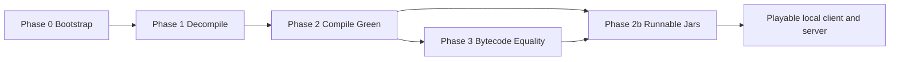

# DESIGN — Minecraft 26.1.2 Reconstruction

> Living design document. This file is the public design spine; topic-specific expansions live under `docs/design/`, `docs/architecture/`, `docs/research/`, and `docs/adr/`. Update this file and the relevant deep-dive note whenever the reconstruction method changes.

## 1. Mission

Reconstruct fully buildable, runnable Java sources for Minecraft 26.1.2 from a user-supplied `ground_truth/26.1.2.jar` such that recompiled `.class` files match the original JVM bytecode at the chosen equality tier. Both client and server must become locally runnable with `java -jar`.

The 26.1.2 JAR is no longer obfuscated, but a decompiler draft is still not a faithful source tree. Vineflower output is incomplete, sometimes uncompilable, and often source-shaped differently enough to alter bytecode. `demcstify` exists to close that gap through an evaluator-grounded LLM workflow.

The repository publishes the reconstruction system, not reconstructed Minecraft code. Users supply their own legitimate local inputs; generated source and runnable artifacts remain local and gitignored.

## 2. Design Principles

1. **Original bytecode is the specification.** The JAR is the oracle; LLM confidence is not a success condition.
2. **Decompiler output is priming.** Vineflower provides a plausible draft, but every class must be rebuilt and checked.
3. **Local reconstruction only.** Reconstructed sources, decompiled drafts, original assets, and runnable jars are never committed.
4. **SQLite is the coordination layer.** Swarms of heterogeneous LLM agents coordinate through atomic SQL claims rather than filesystem status files or lockfiles.
5. **Role scope beats heroics.** Each agent has one role and one write boundary; cross-boundary repairs become separate queue items.
6. **Tier A is the ratchet.** Raw byte equality is the default. Downgrading requires evidence, an ADR, and evaluator approval.
7. **Runnable jars must be clean.** Runtime code must come from reconstructed source outputs or declared dependencies, never copied original `.class` files.
8. **Documentation is part of the system.** Design, architecture, research notes, and ADRs must keep pace with implementation changes.

## 3. Inspirations and Lineage

This design is influenced by two concrete sources of practice:

- [`lifting-bits/remill`](https://github.com/lifting-bits/remill): Remill's LLVM bitcode lifting model shows the value of translating low-level machine artifacts into a compiler-friendly intermediate representation with explicit semantics and deterministic downstream analysis. `demcstify` adopts the same architectural instinct for JVM reconstruction: preserve a precise reference artifact, rebuild through a controlled toolchain, and make equivalence checkable.
- PolyU x NuttyShell Cybersecurity CTF 2026 ([event site](https://2026.polyuctf.com)): real-life experience using LLMs for CTF reverse-engineering and exploit-analysis challenges as the team HackOverflow shaped the agent workflow. While working on one of the event's reverse-engineering challenges, the project author realized that if LLMs can reconstruct code from decompiler evidence, the workflow should be automated through IDA or Ghidra MCP integrations. This project turns that lesson into a database-backed reconstruction pipeline with concrete artifacts, traces, and evaluator oracles.

The design goal is not to make an LLM "invent" Minecraft source. The goal is to make LLMs operate like disciplined reverse engineers: inspect a lossy draft, form a source-level hypothesis, compile it, compare against the oracle, and iterate with durable evidence.

### 3.1 Related Research and Systems

These references shape the reconstruction stance. They are cited prior art and operational influences, not vendored dependencies; no code, datasets, models, or generated outputs from them are copied into this repository.

| Reference | What it contributes | Design implication for `demcstify` |
| --- | --- | --- |
| [DecLLM: LLM-Augmented Recompilable Decompilation](https://dl.acm.org/doi/abs/10.1145/3728958) | Frames decompiler repair around recompilability and an iterative LLM repair loop that uses recompilation and runtime feedback as oracles. | Compile feedback is a first-class phase, not a side effect. Every repair must pass `gradle :subproject:compileJava` before bytecode alignment can claim progress. |
| [LLM4Decompile](https://github.com/albertan017/LLM4Decompile) | Demonstrates that LLMs can complement conventional decompilers, including direct binary-to-source attempts and Ghidra-pseudocode refinement evaluated by re-executability. | Vineflower output is treated as a strong draft, while the evaluator remains external and mechanical. The project optimizes for JVM byte equality rather than readability-only reconstruction. |
| [ByteCodeLLM](https://github.com/cyberark/ByteCodeLLM) | Shows a local-LLM workflow that combines incomplete decompiler output with a complete bytecode evidence path to recover missing source. | `demcstify` keeps original class bytes, `javap` evidence, and decompiler drafts available locally so agents can fall back from source-shaped guesses to bytecode-grounded reconstruction. |
| [D-LiFT](https://arxiv.org/html/2506.10125v2) | Argues that decompiler-improvement pipelines should preserve accuracy before rewarding readability, using an explicit score to penalize inaccurate output. | Tier A/B gates intentionally reward correctness before style. A pretty source rewrite is a regression if it changes bytecode or weakens the oracle. |
| [LLM4CodeRE](https://arxiv.org/abs/2604.06095) | Studies domain-adaptive LLMs for bidirectional reverse engineering, including assembly-to-source decompilation and source-to-assembly generation. | The project keeps model choice separable from the evaluator. Fine-tuned or task-adapted models may improve proposals, but SQLite attempts, compile gates, and bytecode verdicts remain the authority. |
| [The Long Tail of LLM-Assisted Decompilation](https://blog.chrislewis.au/the-long-tail-of-llm-assisted-decompilation/) | Documents the practical slowdown after easy matches, the value of similarity-guided queues, scoped agent hooks, and multi-agent workflow discipline. | SQLite queueing, role scope, attempt history, and future similarity-ranked scheduling exist to survive the long tail instead of relying on one-shot decompilation. |

## 4. Non-Goals

- Redistribute Minecraft source, bytecode, assets, manifests, or other copyrighted material.
- Produce a prettified, idiomatic rewrite that merely behaves similarly.
- Use original bytecode as a shortcut inside runnable jars.
- Let an LLM self-certify completion without the evaluator.
- Mix client and server code ownership in `minecraft-common` for convenience.
- Treat `.omx`, tmux state, terminal output, or markdown notes as the source of truth for work state.

## 5. Acceptance Criteria

The project is complete when all of the following are true on a user's machine with legitimate local inputs:

1. `gradle build` is green across every subproject with zero errors and zero warnings.
2. 100% of inventoried classes have a completed queue row with Tier A `PASS` or an ADR-backed Tier B verdict.
3. `gradle runnableJars` emits:
   - `build/runnable/demcstify-server.jar`
   - `build/runnable/demcstify-client.jar`
4. Both runnable jars launch through `java -jar` with dependency-bundled runtime classpaths.
5. The server boots, reaches a usable game loop, and accepts a compatible vanilla client.
6. The client boots and can connect to a compatible server.
7. Recorded packet traces round-trip byte-equal where protocol equivalence is asserted.
8. `verifyNoGroundTruthCodeInRunnableJars` proves no original `.class` or source entries are embedded in runnable artifacts.
9. `state/progress.db` contains the attempt history and final verdicts for every class.
10. Documentation and ADRs describe any non-Tier-A exceptions.

## 6. Equality Tiers

| Tier | Meaning | Normalization | Approval path |
| --- | --- | --- | --- |
| A | Rebuilt `.class` bytes are identical to the original class bytes | None | Default; `verdict-shim` PASS is sufficient |
| B | Rebuilt class is structurally equivalent but debug/cosmetic compiler artifacts differ | May ignore line tables, `SourceFile`, and constant-pool ordering | Requires failed attempts, ADR, and Autoresearch/evaluator approval |

Tier A is intentionally strict because it exposes decompiler drift that ordinary tests miss. Tier B exists because some compiler artifacts may be impractical to reproduce exactly after exhaustive attempts. The Tier-A percentage is a ratchet metric; it should only improve over time.

## 7. System Phases

The project has four main phases plus a packaging phase. Phases are ordered, but agents may loop inside a phase until its gate is satisfied.



### 7.1 Phase 0 — Bootstrap

Bootstrap creates the reproducible workspace skeleton.

- Read `ground_truth/26.1.2.json` for dependency and Java runtime hints.
- Inventory `ground_truth/26.1.2.jar` and insert class rows into `state/progress.db`.
- Classify packages into subprojects and layers.
- Seed initial work queue rows.
- Probe and pin Java, Gradle, and Vineflower versions.
- Record toolchain evidence in the database and ADRs.

### 7.2 Phase 1 — Decompile

Vineflower is run once through the pinned script. Its output is raw material, not truth.

- Output path: `ground_truth/src-vineflower/`.
- The output is gitignored.
- The `decompiler` role may rerun the pinned tool only when the toolchain or classpath changes.
- The `decompiler` role does not hand-edit output beyond mechanical routing.

### 7.3 Phase 1b — Route

The routing step splits raw decompiler output into subproject source trees.

- `net.minecraft.server.*` and `net.minecraft.gametest.*` route to `minecraft-server`.
- `net.minecraft.client.*`, `net.minecraft.realms.*`, and `com.mojang.realmsclient.*` route to `minecraft-client`.
- Shared Minecraft-domain packages route to `minecraft-common` unless ownership is later narrowed.
- General-purpose libraries carve out into independent subprojects where useful.

### 7.4 Phase 2 — Compile to Green

Compile fixers drive each subproject to zero errors and zero warnings.

- `JavaCompile` uses `-Xlint:all`, `-Werror`, `-parameters`, high diagnostic caps, and sufficient worker heap.
- Compile order follows `layers.ordinal`.
- Agents prefer `ast-grep` for repeated syntactic decompiler repairs.
- Manual edits are reserved for local semantic reconstruction.
- A compile fixer must stay in the claimed subproject.

The phase gate is a clean `gradle :subproject:compileJava` for every subproject and eventually a clean root `gradle build`.

Phase 2 is the functional plateau. By this point the reconstructed game client and server should be functionally all right: the code compiles, the local artifacts can be packaged, and runtime smoke tests should exercise real client/server behavior. However, functional source is not yet faithful source. Different LLMs can still generate different valid Java shapes, idioms, and control-flow flavors for the same behavior.

### 7.5 Phase 3 — Bytecode Equality

Bytecode aligners work one class at a time.

Phase 3 is the mechanical refinement pass. It exists because "works" is not the same as "decompiled." The bytecode diff forces the many possible LLM-generated source variants to converge toward the original compiler artifact. This is where the reconstruction challenge really starts: the agent is no longer just making Java compile and run, but recovering the source shape that produces the same JVM bytecode.

- Claim one `bytecode_aligner` work item from SQLite.
- Run `scripts/bytecode-diff.mjs --class <FQN> --attempt-id <ID> --allow-different`.
- Inspect `state/javap/<FQN>.diff.txt`.
- Patch only the claimed class.
- Recompile the owning subproject.
- Re-run the bytecode diff.
- Run `scripts/verdict-shim.mjs --class <FQN>` before claiming PASS.
- Finish the work item through `scripts/finish-work.sh`.

Line-table spacer edits are allowed only inside the claimed class and only when javap evidence shows that debug metadata is the remaining mismatch.

### 7.6 Phase 2b — Runnable Artifacts

Runnable packaging is downstream of compile and bytecode progress.

- Server main class: `net.minecraft.server.Main`.
- Client main class: `net.minecraft.client.main.Main`.
- Runtime dependencies come from Gradle coordinates derived from the Mojang manifest.
- LWJGL and native classifiers must match the target platform.
- Whitelisted resources may be copied from the original JAR.
- Original `.class` and `.java` entries must never be copied.

The packaging gate is `verifyNoGroundTruthCodeInRunnableJars`.

## 8. Subproject Layering

The layer model keeps compile and bytecode work schedulable.

| Ordinal | Layer | Example subprojects | Dependency direction |
| --- | --- | --- | --- |
| 0 | `common` | `brigadier`, `datafixerupper`, `authlib`, shared utility packages | JDK + external libraries only |
| 1 | `datafix` | DFU-driven schema migrators | `common` |
| 2 | `world` | blocks, NBT, biomes, chunks | `common`, `datafix` |
| 3 | `network` | packets, codecs, protocol | lower layers |
| 4 | `server` | `minecraft-server` | lower layers |
| 5 | `client` | `minecraft-client`, `blaze3d` | lower layers + LWJGL |

Rules:

- Subprojects may depend only on lower layers.
- Sourcepath bridges may provide symbol resolution without creating output ownership.
- Server-owned code stays in `minecraft-server`, even if common classes need a temporary sourcepath bridge to compile.
- Client-only code stays in `minecraft-client` or `blaze3d` as appropriate.

## 9. Toolchain Pinning

Strict byte equality depends on reproducing the original compiler environment as closely as possible.

Pinning cascade:

1. **Manifest stage.** Read `javaVersion.component` and `majorVersion` from `26.1.2.json`.
2. **Fingerprint stage.** Inspect original classfile major/minor versions and any build metadata.
3. **Probe stage.** Compile representative classes under candidate JDKs and compare output deltas.

Mirrors:

| Component | Canonical / mirror location | Purpose |
| --- | --- | --- |
| JDK | `state/progress.db.toolchain`, `gradle.properties`, `.tool-versions` | Bytecode reproducibility |
| Gradle | `gradle/wrapper/gradle-wrapper.properties`, `gradle.properties` | Build reproducibility |
| Vineflower | `scripts/decompile.sh`, `state/progress.db.toolchain` | Decompile reproducibility |
| Decision record | `docs/adr/0001-toolchain-pin.md` | Human-readable rationale |

Autoresearch is reserved for high-stakes toolchain changes because an incorrect toolchain can make Tier A unreachable across thousands of classes.

## 10. SQLite State Model

`state/progress.db` is the authoritative state machine. It is normalized to avoid ambiguous status blobs.

### 10.1 Why SQLite

SQLite is deliberately chosen because the project needs many independent LLM agents to run in parallel without racing for filesystem state.

- Atomic `BEGIN IMMEDIATE` claims prevent duplicate ownership.
- Agents hold database locks only for short claim/finish transactions.
- Compile, diff, and source edits happen outside the database lock.
- Heterogeneous LLM runners can coordinate through SQL without shared process memory.
- Attempt history is append-only and queryable.
- Coverage metrics are computed from views, not hand-maintained notes.

SQLite coordinates parallel edits by assigning disjoint targets. It does not replace role discipline: an agent still may edit only the source scope it claimed.

### 10.2 Lookup Tables

```sql
roles(id PK, name UNIQUE)              -- decompiler, compiler_fixer, bytecode_aligner, verifier, librarian
tiers(id PK, name UNIQUE)              -- A, B
verdicts(id PK, name UNIQUE)           -- PASS, FAIL, DEGRADED, PENDING
compile_statuses(id PK, name UNIQUE)   -- GREEN, RED, UNKNOWN
diff_statuses(id PK, name UNIQUE)      -- IDENTICAL, DIFFERENT, PENDING
diff_scopes(id PK, name UNIQUE)        -- METHOD, FIELD, ATTRIBUTE, CONSTANT_POOL, INSTRUCTION, ACCESS_FLAGS
probe_sources(id PK, name UNIQUE)      -- MANIFEST, FINGERPRINT, BRUTE_FORCE
layers(id PK, name UNIQUE, ordinal INT UNIQUE)
```

### 10.3 Static Structure

```sql
subprojects(name PK, layer_id FK -> layers, gradle_path UNIQUE)
classes(fqn PK, subproject_name FK -> subprojects, target_tier_id FK -> tiers)
agents(id PK, name UNIQUE)
```

### 10.4 Dynamic History

```sql
attempts(
  id PK,
  work_queue_id FK -> work_queue NULL,
  class_fqn FK -> classes NULL,
  agent_id FK -> agents,
  role_id FK -> roles,
  started_at TIMESTAMP,
  finished_at TIMESTAMP NULL,
  compile_status_id FK -> compile_statuses,
  diff_status_id FK -> diff_statuses,
  achieved_tier_id FK -> tiers NULL,
  verdict_id FK -> verdicts,
  notes TEXT
);

diff_entries(
  attempt_id FK -> attempts,
  ordinal INT,
  scope_id FK -> diff_scopes,
  location TEXT,
  before_text TEXT NULL,
  after_text TEXT NULL,
  PRIMARY KEY (attempt_id, ordinal)
);

javap_reports(
  attempt_id PK FK -> attempts,
  path TEXT UNIQUE,
  generated_at TIMESTAMP
);
```

### 10.5 Scheduling

```sql
work_queue(
  id PK,
  role_id FK -> roles,
  subproject_name FK -> subprojects,
  target_class_fqn FK -> classes NULL,
  priority INT,
  claimed_by_agent_id FK -> agents NULL,
  claimed_at TIMESTAMP NULL,
  completed_at TIMESTAMP NULL
);
```

`scripts/claim-work.sh` atomically claims the lowest-layer open row and inserts a `PENDING` attempt. `scripts/finish-work.sh` completes the attempt, marks the queue row complete on PASS, or releases the claim on failure.

### 10.6 Views

- `current_class_state` — latest attempt joined to each class.
- `subproject_health` — compile/diff rollups per subproject.
- `tier_a_coverage` — Tier-A ratchet metric.

## 11. Work-Claim Protocol

Every role follows the same lifecycle:

1. Query the lowest layer with outstanding work.
2. Claim atomically via `scripts/claim-work.sh`.
3. Insert or reuse the generated `attempts` row.
4. Work inside the claimed write scope.
5. Run the role-specific evaluator.
6. Persist compile/diff/verdict status.
7. Mark the queue row complete only on PASS.
8. Release the claim on failure so another agent can retry.

No agent may mark work complete from chat memory or terminal intuition.

## 12. Agent Roles

| Role | Charter | Write scope | PASS evidence |
| --- | --- | --- | --- |
| `decompiler` | Run pinned Vineflower and route output | Decompile/routing output only | Decompile and routing scripts complete |
| `compiler_fixer` | Make one subproject compile with zero warnings | One subproject source tree | `gradle :subproject:compileJava` green |
| `bytecode_aligner` | Make one class match target tier | One claimed class | `verdict-shim` PASS |
| `verifier` | Independently validate a claim | No source writes | Re-run build + diff |
| `librarian` | Keep docs, ADRs, and schema accurate | Docs/schema only | Docs and schema match current workflow |

A role cannot silently widen scope. If bytecode alignment requires changing another class, the aligner files or claims a separate work item.

## 13. Bytecode-Diff Verification

The evaluator is script-backed and Gradle-exposed.

- `scripts/bytecode-diff.mjs` reads original bytes from `ground_truth/26.1.2.jar`.
- It reads rebuilt bytes from the owning subproject build output.
- It compares raw bytes for Tier A.
- On mismatch, it emits `javap -v -p` reports for both classes.
- It stores bounded diff entries when an attempt ID is provided.
- `scripts/verdict-shim.mjs` produces the canonical PASS/FAIL JSON.

Canonical PASS shape:

```json
{ "class": "net.minecraft.Example", "tier": "A", "verdict": "PASS" }
```

Agents may describe progress, but only this evaluator can prove completion.

## 14. Repeated Repair Patterns

Early reconstruction has identified common Vineflower drift families.

| Pattern | Bytecode symptom | Normal repair |
| --- | --- | --- |
| Broad decompiler `@SuppressWarnings` | Line numbers shifted | Remove if compile remains warning-free |
| Ternary where original used branch returns | Extra `goto` or stack-map frame | Restore explicit branch/early-return shape |
| Boolean condition flattening | Different branch offsets | Reconstruct guard clauses or `continue` blocks |
| Static declaration order drift | `<clinit>` line/bootstrap mismatch | Restore field declaration order and source layout |
| Compound assignment drift | Different arithmetic op sequence | Restore compound operator shape |
| Generic raw/unchecked decompiler output | Compile warnings/errors | Add narrow type helper or restore generic signature |
| Debug-line-only mismatch | Same instructions, different raw bytes | Use minimal line-table spacing inside claimed class |

AST-aware tools such as `ast-grep` should be used for repeated syntactic repairs. One-off semantic repairs remain manual and javap-guided.

## 15. Runnable Artifact Design

Runnable jars are local outputs that prove the reconstructed source tree can execute.

Rules:

- Server code remains in `minecraft-server`.
- Client code remains in `minecraft-client` or client-owned rendering/audio subprojects.
- `minecraft-common` may contain shared code but must not absorb server-only implementation for convenience.
- External dependencies are resolved through Gradle.
- Original resources are copied only from an explicit whitelist.
- Original Java bytecode and source are excluded.
- `verifyNoGroundTruthCodeInRunnableJars` runs as part of `check` and `runnableJars`.

Target artifacts:

```text
build/runnable/demcstify-server.jar
build/runnable/demcstify-client.jar
```

## 16. Test Strategy

The equality oracle is the base layer. Traditional tests are added as components become buildable.

| Layer | Activation point | Scope |
| --- | --- | --- |
| Bytecode equality | Day one | Per-class correctness gate |
| Unit | Non-MC and utility subprojects compile | Library and helper behavior |
| Integration | Server/client subprojects compile | Server boot, client boot, protocol handshake |
| End-to-end | Runnable jars exist | Local world startup and client/server interaction |
| Security | Day one | Secret scan, dependency scan, jar-boundary checks |
| Fuzzing | Parsers/codecs compile | NBT, packets, Anvil, codecs |

## 17. Publication Contract

The public repository publishes the method, not the reconstructed game.

- User-supplied originals live under `ground_truth/` and remain gitignored.
- Vineflower output lives under `ground_truth/src-vineflower/` and remains gitignored.
- Reconstructed sources live under `subprojects/*/src/` and remain gitignored.
- Build outputs and runnable jars remain gitignored.
- Scaffolding, documentation, schema, queue scripts, Gradle glue, and evaluators are publishable.

The detailed publication boundary is in [`docs/design/01-publication-contract.md`](docs/design/01-publication-contract.md).

Minecraft, Mojang, Mojang Studios, and related game code, assets, names, and marks are property of Mojang Studios and Microsoft. All rights are reserved by Mojang Studios and Microsoft.

## 18. Closing Thesis

The emergence of LLMs creates a direct challenge to the assumption that obscurity alone can protect software intellectual property. Heavily obfuscated, mutated, or virtualized code may still be mechanically lifted into an analyzable intermediate form and then recontextualized by a model. [`remill`](https://github.com/lifting-bits/remill) demonstrates the value of translating binary instructions into compiler-friendly IR; [`PS2Recomp`](https://github.com/ran-j/PS2Recomp), [`XenonRecomp`](https://github.com/hedge-dev/XenonRecomp), and [`RPCS3`](https://github.com/RPCS3/rpcs3) demonstrate adjacent techniques for preserving console machine state, recompiling runtime behavior, or emulating full systems by translating the low level instructions into multiple higher level IR, similar to remill but goes straight into another target's machine code as a form of JIT or AOT.

Java makes this reality even sharper. JVM bytecode is structured, inspectable, and rich with semantic hints. Obfuscators such as ProGuard and RetroGuard can scramble names and shapes, but they do not erase execution semantics. With LLMs in the loop, devirtualization, deobfuscation, and source recontextualization become systematic workflows rather than one-off reverse-engineering tricks.

This project therefore treats source reconstruction as both a technical experiment and a warning. If code can be cheaply regenerated or reconstructed, then sustainable value moves toward the "talk" around the code: design intent, tests, evaluator evidence, licensing boundaries, provenance, and operational responsibility. The old engineering slogan, famously from Linus Torvalds was, "talk is cheap, show me the code." In an LLM-saturated software world, `demcstify` argues the inverse is increasingly true: **code is cheap; show me the talk**.

## 19. Risks and Mitigations

| Risk | Impact | Mitigation |
| --- | --- | --- |
| Vineflower produces misleading source | Compile or bytecode mismatch | Treat output as draft; verify every class |
| Wrong JDK/toolchain | Tier A impossible at scale | Probe cascade and ADRs |
| Agent edits outside scope | Hidden regressions and merge conflicts | SQLite claims plus role guardrails |
| Filesystem-state races | Duplicate edits or lost claims | SQLite atomic claim/finish transactions |
| Hard class starves queue | Throughput collapse | Claim rows with fewer attempts first; downgrade discipline |
| Original bytecode leaks into runnable jar | Legal and correctness failure | Jar guard task and resource whitelist |
| Documentation falls behind | Agents follow stale rules | Librarian role and living-doc requirement |

## 20. Open Design Tasks

- Finalize the Tier-B structural comparator.
- Generate publication snapshots from `state/progress.db`.
- Add a report for common bytecode-diff patterns by package and subproject.
- Expand integration harnesses for server boot and client handshake.
- Formalize ADR requirements for toolchain changes and Tier-B downgrades.
- Keep the MIT license boundary explicit as publication docs evolve.
