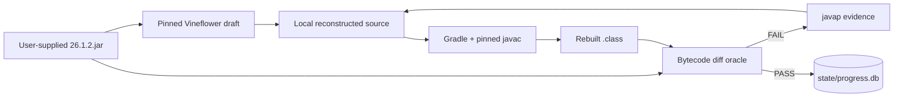

# demcstify

> Research project: LLM-assisted reconstruction of partially decompiled Minecraft 26.1.2 sources into fully buildable, runnable, bytecode-equivalent local client and server artifacts.

`demcstify` is not a Minecraft source distribution. It is a reconstruction lab: a set of documents, scripts, Gradle build logic, database schema, and evaluator tools that coordinate LLM agents against a deterministic bytecode oracle. The user's machine supplies the original JAR, performs the reconstruction, and keeps all reconstructed source and build outputs local.

## Legal Stance — Read Before Doing Anything

**This repository contains no Minecraft game files and no reconstructed Minecraft source code.** No JARs, no assets, no manifests, no decompiled output, no repaired sources, no rebuilt classes, and no copyrighted code from Mojang or Microsoft will ever be committed here.

Minecraft, Mojang, Mojang Studios, and related game code, assets, names, and marks are property of Mojang Studios and Microsoft. All rights are reserved by Mojang Studios and Microsoft. This project claims no ownership of, license to, or endorsement by those rights holders. See [`NOTICE.md`](NOTICE.md).

Local-only paths are intentionally gitignored:

| Path | What lives there | Why it is local only |
| --- | --- | --- |
| `ground_truth/26.1.2.jar` | User-supplied original JAR | The original game is not redistributed |
| `ground_truth/26.1.2.json` | User-supplied manifest | The manifest is part of the local input |
| `ground_truth/src-vineflower/` | Raw decompiler output | Decompiled source is not published |
| `subprojects/*/src/` | Reconstructed Java source | Repaired/reconstructed code stays on the user's machine |
| `subprojects/*/build/` | Recompiled classes and per-subproject jars | Build outputs stay local |
| `build/runnable/` | Runnable client/server jars | User-local artifacts only |

Only scaffolding belongs in the repository: documentation, agent guardrails, Gradle glue, scripts, schema, evaluators, ADRs, and research notes.

If you do not own a legitimate license to Minecraft 26.1.2, do not use this project. You are responsible for compliance with the Minecraft EULA and applicable law in your jurisdiction. If a rights holder requests changes, the maintainer will comply.

## What Problem This Solves

Modern Java Minecraft releases are distributed in a form that is far friendlier to analysis than old obfuscated releases, but a decompiler still does not produce a clean, buildable, bytecode-identical source tree. Vineflower can recover a plausible draft, yet it commonly introduces errors:

- invalid or over-broad generics;
- missing or malformed bridge patterns;
- wrong branch shape for `if`, ternary, and `switch` constructs;
- line-table drift from added annotations or reformatted source;
- static-initializer declaration-order drift;
- source layout that compiles but produces different stack maps or constant-pool shape.

`demcstify` treats the original `.class` files as the specification. Reconstructed source is correct only when the rebuilt class passes the evaluator at the target equality tier.

## The Core Idea

This project is a testbed for **multi-agent LLM-driven source reconstruction against a bytecode oracle**.



The compressed paradigm:

- **The oracle is mechanical, not human.** A rebuilt class either matches the original at the chosen tier or it does not.
- **The decompiler is priming, not truth.** Vineflower output is a draft to repair, not a source of authority.
- **Roles are strict.** Decompilers, compile fixers, bytecode aligners, verifiers, and librarians have separate write scopes.
- **State is relational and append-only.** SQLite records claims, attempts, verdicts, diffs, and coverage.
- **Swarm coordination uses SQL, not lockfiles.** Different LLM runners can work in parallel by atomically claiming queue rows instead of racing over markdown status files or filesystem locks.
- **Tier A is the default.** Raw byte equality is the normal target; semantic fallback requires a recorded ADR.

The full conceptual frame lives in [`docs/research/01-llm-reconstruction-paradigm.md`](docs/research/01-llm-reconstruction-paradigm.md). The workflow-specific research note lives in [`docs/research/02-llm-decompilation-workflow.md`](docs/research/02-llm-decompilation-workflow.md).

## Inspirations and Lineage

`demcstify` is inspired by two practical lines of work:

- [`lifting-bits/remill`](https://github.com/lifting-bits/remill), which demonstrates how a large binary-reasoning system can lift machine-code instructions into LLVM bitcode as a stable intermediate representation. `demcstify` applies the same spirit to JVM bytecode: choose a precise intermediate artifact, make translation evidence-driven, and let downstream tooling compare outputs mechanically.
- Real-life experience using LLMs for CTF reverse-engineering and cybersecurity challenges during PolyU x NuttyShell Cybersecurity CTF 2026 ([event site](https://2026.polyuctf.com)) as the (almost sole member of) team HackOverflow. While working on one of the event's reverse-engineering challenges, the project author realized that if LLMs can reconstruct code from decompiler evidence, the workflow should be automated through IDA or Ghidra MCP integrations. Those workflows showed that LLMs are most useful when they reason over decompiler output, traces, and tight oracles rather than free-form guesses.

The project translates that experience into a reproducible software-reconstruction lab: the decompiler gives a draft, the LLM proposes source repairs, and bytecode equality decides whether the repair is real.

## What This Repository Contains

| Area | Files | Purpose |
| --- | --- | --- |
| Project docs | `README.md`, `DESIGN.md`, `ARCHITECTURE.md`, `docs/**` | Publishable design, architecture, research, and ADRs |
| Agent protocol | `AGENTS.md`, `LLM_CODESTYLES.md` | Role discipline, queue protocol, style, and verification rules |
| Build glue | `settings.gradle.kts`, `build.gradle.kts`, `gradle.properties`, `gradle/**` | Layered Java subprojects, pinned toolchain, runnable jars |
| State schema | `scripts/progress-schema.sql`, `state/progress.db` | SQLite queue, attempts, verdicts, coverage, toolchain pins |
| Decompiler pipeline | `scripts/decompile.sh`, `scripts/route-vineflower-output.sh` | Pinned Vineflower and mechanical source routing |
| Queue operations | `scripts/claim-work.sh`, `scripts/finish-work.sh`, `scripts/enqueue-work.sql`, `scripts/enqueue-bytecode-work.sh` | Atomic work claims and lifecycle transitions |
| Evaluator | `scripts/bytecode-diff.mjs`, `scripts/verdict-shim.mjs` | Raw class-byte comparison, javap evidence, canonical PASS JSON |
| Toolchain probe | `scripts/probe-toolchain.sh`, `docs/adr/0001-toolchain-pin.md` | Java/Gradle/Vineflower pinning evidence |

## What You Must Supply

Place your legitimate, local Minecraft 26.1.2 files here:

```text
ground_truth/26.1.2.jar
ground_truth/26.1.2.json
```

Both paths are gitignored. The scripts read them locally. The project does not download or redistribute them.

## High-Level Workflow

1. **Bootstrap state.** Inventory the JAR, classify classes into subprojects, seed `state/progress.db`, and record toolchain hints.
2. **Decompile once.** Run pinned Vineflower into `ground_truth/src-vineflower/`.
3. **Route mechanically.** Split decompiled source into `subprojects/<name>/src/main/java` by package ownership.
4. **Compile to green.** Fix one subproject at a time until `compileJava` has zero errors and zero warnings.
5. **Align bytecode.** Claim one class, compare rebuilt class bytes to the original, patch only that class, repeat until PASS or release.
6. **Verify independently.** A verifier re-runs the affected build and diff before claims are treated as durable.
7. **Package local runnable jars.** Build dependency-bundled client and server jars from reconstructed outputs only.
8. **Guard legal boundaries.** Fail packaging if original bytecode appears in a runnable artifact.

Phase 2 is the functional plateau: the game client and server should be generally usable once the source compiles cleanly and packages locally. That is not yet faithful decompilation. Different LLMs can still produce different source shapes, naming choices, and control-flow flavors that behave acceptably but compile into different bytecode. The bytecode-diff pass is the mechanical refinement pass that forces those variants to converge toward true source-code decompilation. This is where the hard challenge really starts.

A larger diagram lives in [`docs/architecture/01-llm-decompilation-workflow.md`](docs/architecture/01-llm-decompilation-workflow.md).

## Equality Tiers

| Tier | Meaning | Normalization |
| --- | --- | --- |
| A | Rebuilt `.class` is byte-for-byte identical to the original class from `ground_truth/26.1.2.jar` | None |
| B | Rebuilt `.class` is structurally/semantically equivalent when cosmetic compiler artifacts are ignored | Line tables, source-file attribute, and constant-pool ordering may be normalized |

Tier A is the default target for every class. Tier B is a formal downgrade, not an excuse: it requires failed attempts, a documented ADR, and evaluator approval.

## Why SQLite Is Central

`state/progress.db` is not a convenience file; it is the concurrency and audit backbone.

A swarm of LLM agents can run at the same time because each agent performs a tiny atomic transaction to claim work, then does expensive compile/diff/source work outside the database lock. This avoids the usual failure modes of multi-agent coding sessions:

- two agents editing the same class because they both read a stale markdown checklist;
- broad filesystem lockfiles blocking unrelated work;
- local tmux/session memory disagreeing with another LLM runner;
- PASS claims that are not connected to a reproducible evaluator artifact.

The database owns queue state. Terminal logs and `.omx` logs are evidence, not truth.

Useful queries:

```sql
SELECT * FROM tier_a_coverage;

SELECT attempts.id, attempts.work_queue_id, attempts.class_fqn, roles.name, attempts.started_at
FROM attempts
JOIN roles ON roles.id = attempts.role_id
WHERE attempts.finished_at IS NULL;

SELECT class_fqn, COUNT(*) AS failures
FROM attempts
JOIN verdicts ON verdicts.id = attempts.verdict_id
WHERE verdicts.name = 'FAIL'
GROUP BY class_fqn
ORDER BY failures DESC;
```

## Typical Commands

These commands assume the local ground-truth files are already present.

```bash
# Verify / fetch the pinned Gradle runtime, then run a task.
scripts/gradle.sh tasks

# Initialize or refresh the progress database from the local JAR.
scripts/init-progress-db.sh

# Run pinned Vineflower.
scripts/decompile.sh

# Route Vineflower output into local, gitignored subproject source trees.
scripts/route-vineflower-output.sh

# Claim one queue item atomically.
scripts/claim-work.sh --agent "your-agent-name"

# Compile one subproject.
scripts/gradle.sh :minecraft-common:compileJava

# Compare one rebuilt class against the original.
scripts/bytecode-diff.mjs --class net.minecraft.Example --attempt-id 123 --allow-different

# Produce the canonical evaluator verdict.
scripts/verdict-shim.mjs --class net.minecraft.Example

# Finish a claimed work item.
scripts/finish-work.sh --work-id 123 --verdict PASS --compile GREEN --diff IDENTICAL --achieved-tier A
```

## Agent Roles

| Role | Writes | Must not do | Completion evidence |
| --- | --- | --- | --- |
| `decompiler` | Raw/local decompile output and mechanical routing output | Hand-repair decompiled source | Decompile and route commands complete |
| `compiler_fixer` | One assigned subproject source tree | Bytecode-align unrelated classes | `gradle :subproject:compileJava` green with zero warnings |
| `bytecode_aligner` | One claimed class | Modify neighboring classes silently | `verdict-shim` returns PASS for that class |
| `verifier` | No source writes | Verify its own changes | Independent build + diff evidence |
| `librarian` | Docs, ADRs, schema migrations | Touch reconstructed sources | Docs/schema match current system |

See [`AGENTS.md`](AGENTS.md) for the binding protocol.

## Runnable Artifacts

The target local outputs are:

```text
build/runnable/demcstify-server.jar
build/runnable/demcstify-client.jar
```

They must be runnable with `java -jar`, dependency-bundled, and assembled from reconstructed class outputs plus declared third-party dependencies. The only material copied from the original JAR is a whitelist of non-code resources required by the game runtime. Original `.class` and `.java` entries are forbidden.

`verifyNoGroundTruthCodeInRunnableJars` is wired into the build to enforce this boundary.

## Documentation Map

- [`DESIGN.md`](DESIGN.md) — product/technical design, acceptance criteria, state model, drivers, risks.
- [`ARCHITECTURE.md`](ARCHITECTURE.md) — repository layout, subproject layering, data flow, build outputs, CI topology.
- [`docs/README.md`](docs/README.md) — full documentation index.
- [`docs/design/01-publication-contract.md`](docs/design/01-publication-contract.md) — publishable/legal boundary.
- [`docs/architecture/01-llm-decompilation-workflow.md`](docs/architecture/01-llm-decompilation-workflow.md) — workflow diagrams.
- [`docs/research/01-llm-reconstruction-paradigm.md`](docs/research/01-llm-reconstruction-paradigm.md) — research thesis.
- [`docs/research/02-llm-decompilation-workflow.md`](docs/research/02-llm-decompilation-workflow.md) — workflow research notes.
- [`docs/research/03-compile-diagnostics-and-ast-repairs.md`](docs/research/03-compile-diagnostics-and-ast-repairs.md) — compile diagnostics and AST-aware repair notes.
- [`docs/adr/0001-toolchain-pin.md`](docs/adr/0001-toolchain-pin.md) — bootstrap toolchain decision.

## Status

Active reconstruction scaffolding. The repository currently publishes the method and tooling, not reconstructed source. Current progress is intentionally not hardcoded in this README; query `state/progress.db` for live local status.

## Closing Thesis

LLMs change the security and intellectual-property landscape. Code that once seemed protected by obfuscation, mutation, virtualization, or platform-specific binary form can often be partially recovered with a combination of mechanical lifting and model-assisted recontextualization. Projects such as [`remill`](https://github.com/lifting-bits/remill), [`PS2Recomp`](https://github.com/ran-j/PS2Recomp), [`XenonRecomp`](https://github.com/hedge-dev/XenonRecomp), and [`RPCS3`](https://github.com/RPCS3/rpcs3) show different parts of that technical reality: lift machine instructions, preserve machine state, translate runtime behavior, or emulate an entire platform.

That pressure is especially sharp for Java. Bytecode carries rich semantic structure, and long-standing obfuscators such as ProGuard and RetroGuard raise the cost of recovery without making recovery impossible. In the LLM era, devirtualization, deobfuscation, and recontextualization are no longer rare artisanal steps; they are becoming repeatable workflows.

The lesson is not that intellectual property stops mattering. The lesson is that **security through obscurity needs a reality check**. Obfuscation cannot substitute for clear licensing, good architecture, explicit trust boundaries, or honest engineering. If software is increasingly industrially produced, then the enduring value is not merely the text of code. It is the intent, explanation, constraints, tests, provenance, legal boundary, and maintenance story around it. The old maxim was "talk is cheap, show me the code." For this project, the closer is: **code is cheap; show me the talk**.

## License

The lab scaffolding in this repository is licensed under the MIT License. See [`LICENSE`](LICENSE).

The MIT License applies only to this project's own code and documentation: scripts, Gradle build logic, database schema, evaluator tooling, agent instructions, ADRs, and research/design/architecture notes. It does **not** apply to user-supplied `ground_truth/` files, raw Vineflower output, locally reconstructed Minecraft source, rebuilt classes, runnable jars, Minecraft assets, Minecraft names/marks, or any other Mojang Studios / Microsoft material.

Minecraft, Mojang, Mojang Studios, and related game code, assets, names, and marks are property of Mojang Studios and Microsoft. All rights are reserved by Mojang Studios and Microsoft. This project claims no rights to them.

## Contributing

Read [`AGENTS.md`](AGENTS.md), [`LLM_CODESTYLES.md`](LLM_CODESTYLES.md), [`DESIGN.md`](DESIGN.md), and [`ARCHITECTURE.md`](ARCHITECTURE.md) before opening a PR or running agent workflows.

Do not commit reconstructed source, original game files, decompiled output, rebuilt classes, runnable jars, or local heap dumps.
