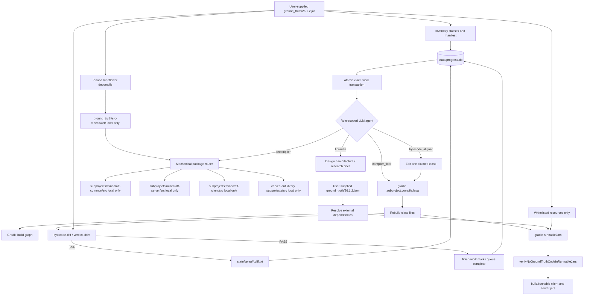
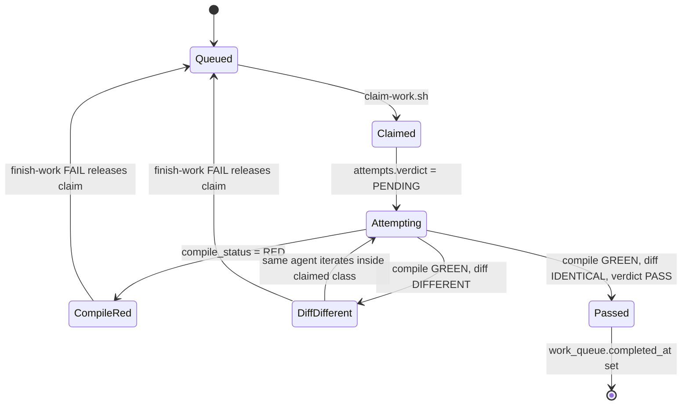

# Architecture Note 01 - LLM Decompilation Workflow

> This note describes the runtime workflow. `state/progress.db` is the authoritative state machine; `.omx` logs are evidence only.

## Overview

The workflow turns a user-supplied JAR into local reconstructed Java source through a strict loop: decompile, route, compile, align bytecode, verify, and package. LLM agents operate as workers inside that loop, but they do not decide success. The SQLite database records ownership and history; the bytecode evaluator records truth.

Phase 2 is intentionally a functional plateau: the reconstructed client and server should compile cleanly, package locally, and behave plausibly in runtime smoke tests. That is useful but incomplete. Different LLMs can still produce different code flavors that are functionally acceptable yet bytecode-distinct. The diff pass is the mechanical refinement pass that begins the hard part of the project: forcing those source variants to converge toward true source-code decompilation against the original class oracle.

## High-Level Diagram



## Sequence Diagram

```mermaid
sequenceDiagram
  autonumber
  participant Agent as LLM agent
  participant DB as state/progress.db
  participant Src as Local reconstructed source
  participant Gradle as Gradle/Javac
  participant Diff as bytecode-diff + verdict-shim
  participant Jar as ground_truth/26.1.2.jar

  Agent->>DB: BEGIN IMMEDIATE; claim lowest-layer work item
  DB-->>Agent: work_id, attempt_id, class_fqn, role
  Agent->>Src: read and edit only the claimed source scope
  Agent->>Gradle: compile affected subproject with -Xlint:all -Werror -parameters
  Gradle-->>Agent: GREEN or diagnostics
  Agent->>Diff: compare rebuilt class against original class
  Diff->>Jar: read original class bytes
  Diff-->>DB: persist diff status, javap report, diff entries
  alt PASS
    Agent->>Diff: run verdict-shim for canonical PASS JSON
    Agent->>DB: finish-work PASS, complete queue row
  else FAIL
    Agent->>DB: finish-work FAIL and release claim, or continue same class
  end
```

## State Machine



## Role Boundaries

| Role | Write scope | Success evidence |
| --- | --- | --- |
| `decompiler` | `ground_truth/src-vineflower/` and mechanical routing output | Decompile completes and routed files land in the assigned subproject |
| `compiler_fixer` | One assigned subproject source tree | `gradle :subproject:compileJava` is zero error and zero warning |
| `bytecode_aligner` | One claimed class | `scripts/verdict-shim.mjs --class <FQN>` emits `verdict=PASS` |
| `verifier` | No source writes | Re-runs build and diff independently |
| `librarian` | Docs, ADRs, schema migrations | Docs match current architecture and constraints |

The source boundary is as important as the pass condition. A bytecode aligner may read dependencies, but it may not fix neighboring classes inside the same attempt. If a class requires another class to change, the correct action is to file or claim a separate work item.

## Data Ownership

- `state/progress.db` owns queue state, attempts, verdicts, toolchain pins, and coverage views.
- `state/javap/` owns reproducible local diff evidence.
- `ground_truth/` owns user-supplied inputs and raw decompiler output; it is never committed.
- `subprojects/*/src/` owns reconstructed source; it is never committed.
- Build glue and evaluator scripts are committed because they are the reproducible method.

## Packaging Path

Runnable packaging is downstream of source reconstruction. It must not use original bytecode as a shortcut.

1. Compile reconstructed sources into subproject build outputs.
2. Resolve external libraries from declared Gradle dependencies.
3. Copy only whitelisted non-code resources from the ground-truth JAR.
4. Build `demcstify-server.jar` and `demcstify-client.jar` with explicit main classes.
5. Run `verifyNoGroundTruthCodeInRunnableJars` before treating any runnable artifact as usable.

## Operational Failure Modes

| Failure mode | Mitigation |
| --- | --- |
| LLM claims success without evidence | PASS is accepted only from `verdict-shim` and `finish-work` rows |
| Agent overwrites unrelated reconstructed code | One role, one claimed work item, one write scope |
| A released failed class starves the queue | `claim-work.sh` prefers rows with fewer prior attempts |
| Decompiled source drifts from legal boundary | `subprojects/*/src/` and `ground_truth/` stay gitignored |
| Original bytecode leaks into runnable jars | `verifyNoGroundTruthCodeInRunnableJars` is wired into checks |
| Debug metadata blocks Tier A | Line-table reconstruction is allowed only inside the claimed class and only with diff evidence |
